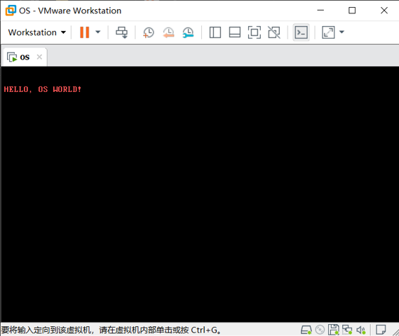

# Day  1

自制一个操作系统，你需要以下工具:

* `Notepad++`，当然，其它文本编辑器也可以替代
* `VMWare`虚拟机
* `16`进制编辑器
* `nasm`，可以去网上下载

## 建立一个汇编文件

```assembly
              ORG 07C00H            	;告诉编译器程序被加载的地址为0x7c00
              MOV AX, CS
              MOV DS, AX
              MOV ES, AX
              CALL SHOW
              JMP $
              SHOW:
              MOV AX, MESSAGE
              MOV BP, AX
              MOV CX, 16
              MOV AX, 01301H        	;AH = 13H AL = 01H
              MOV BX, 000CH         	;页号为0 BH = 0 红底黑字 BL = 0CH
              MOV DL, 0
              INT 10H
              RET
    MESSAGE:  DB "HELLO, OS WORLD!"
              TIMES 510 - ($ - $$) DB 0	;剩下的字节全部使用0填充
              DW 0XAA55             	;
```

这里我们简单理解一下汇编代码，如果有汇编的基础，上面代码应该容易理解。首先，一条`ORG`指令，将设定程序的加载地址，这一地址也是默认的地址。

紧接着，初始化寄存器，然后调用子过程，最后死循环(`jmp $`)

子过程中，会调用`BIOS`系统调用`0x10`，向屏幕打印一行字符串`HELLO, OS WORLD!`。

最后，用0填充文件大小，最后两个字节分别是`0x55`和`0xaa`。为什么是这两个数字呢，这就类似于`PE`文件或者`ELF`文件的幻数(`Magic number`)一样，只有设定为这一值，系统才会认为这是一个可引导的扇区。汇编中注意小端序`0xAA55`。

## 用 nasm 编译文件

这里如果没有配置环境变量，可以在`nasm`文件夹下，打开`cmd`，输入命令，注意文件路径

```bash
nasm.exe day1.asm -o boot.bin
```

当然，我们也可以使用`Makefile`，写好脚本，帮助我们执行这一流程

```makefile
# 默认动作
default :
	../tools/make.exe boot

# 镜像文件生成
boot.bin : day1.asm Makefile
	../tools/nasm/nasm.exe day1.asm -o boot.bin

# 其他指令
boot:
	../tools/make.exe -r boot.bin
```

## 加电开机

最后，打开`VMWare`，创建一个虚拟机，类别均选择其它，采用软盘加载我们的`boot.bin`文件。开机后，我们便能够看到以下画面。



这也说明我们主引导扇区加载完成。

## [Day 2](OS/Day2/day2.md)