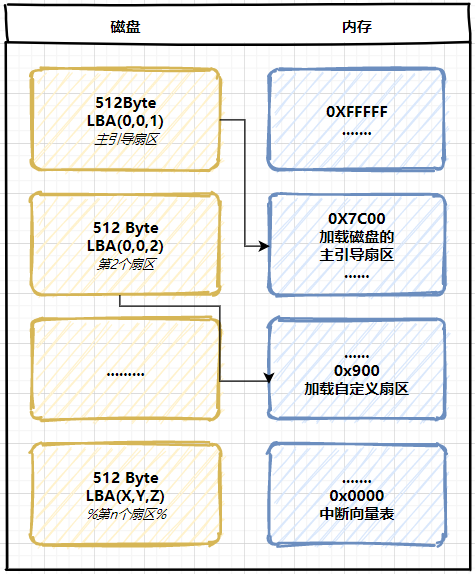
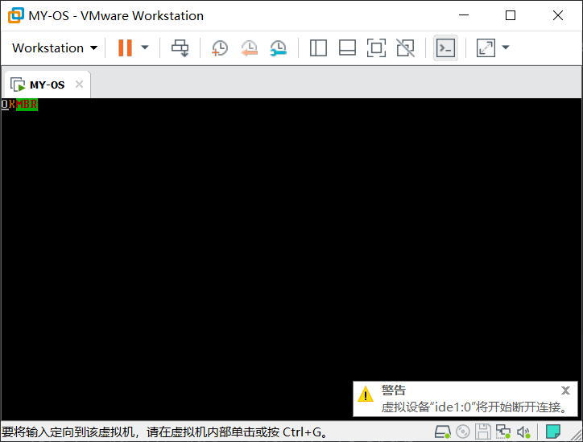

# Day 2

## 磁盘加载

在上一讲中，我们只是制作了一个大小仅为`512 Byte`的软盘，现在我们需要给我们的操作系统分配一定空间的硬盘。

打开`cmd`，输入`diskpart`，创建一个虚拟磁盘，给出指定路径，然后给出大小，这里为`10 MB`。

```bash
create vdisk file = E:\Git\gitcode\blog\docs\OS\dingst.vhd maximum = 10 type=fixed
```

然后，我们将上一次得到的软盘内容，写入到这个磁盘里面，这里可以使用`dd.exe`工具(其实是`linux`的一个命令)。这里使用`git bash`可能会失败，最好还是下载一个`dd.exe`。

```bash
dd if=boot.bin of=dingst.vhd bs=512 count=1
```

此时，我们准备好了一块可装载的磁盘，在创建虚拟机时，采用已有磁盘，并添加我们的`dingst.vhd`即可。加电开机，可以发现，屏幕成功输出了对应字符串。

## 突破 512 Byte 的限制

现在我们的磁盘只有第一个扇区，即前`512 Byte`是有效的，其它部分基本都是`0`。我们将继续写入一部分内容。这里我们依旧会用到`Makefile`，方便我们不断调试。这一块的思路如下:

在主引导扇区中，我们需要新增一些代码，`day1`中，我们仅仅输出了一个字符串，`512 Byte`还能做更多的事，因此我们添加的程序要能够帮我们读磁盘的第二个扇区，将第二个扇区的内容，加载至内存`0x900`处，这个地址可以自己选择，但是有一定的范围。

我们可以先看看哪些地址是你可以选择的。

|  起始   |  结束   |    大小    |                             用途                             |
| :-----: | :-----: | :--------: | :----------------------------------------------------------: |
| `FFFF0` | `FFFFF` |   `16 B`   | `BIOS` 入口地址，此地址也属于`BIOS`代码，这`16`字节的内容是为了执行跳转指令 |
| `F0000` | `FFFEF` | `64KB-16B` | 系统`BIOS`的地址范围实际上是`F000-FFFFF`，上面是入口地址，所以单独列出 |
| `C8000` | `EFFFF` |  `160KB`   |            映射硬件适配器的`ROM`或内存映射式`I/O`            |
| `C0000` | `C7FFF` |   `32KB`   |                       显示适配器`BIOS`                       |
| `B8000` | `BFFFF` |   `32KB`   |                      文本模式显示适配器                      |
| `B0000` | `B7FFF` |   `32KB`   |                        黑白显示适配器                        |
| `A0000` | `AFFFF` |   `64KB`   |                        彩色显示适配器                        |
| `9FC00` | `9F000` |   `1KB`    |       `EBDA(Extended BIOS Data Area)` 扩展`BIOS`数据区       |
| `7E00`  | `9FBFF` |  `≈608KB`  |                           可区域用                           |
| `7C00`  | `7DFF`  |   `512B`   |                    `MBR`被`BIOS`加载区域                     |
|  `500`  | `7BFF`  |  `≈30KB`   |                           可区域用                           |
|  `400`  |  `4FF`  |   `256B`   |                       `BIOS Data Area`                       |
|  `000`  |  `3FF`  |   `1KB`    |             `Interrupt Vector Table` 中断向量表              |

在这张实模式下内存布局的图中，我们可以看到，只有两个区域是我们可以使用的，其它区域均有数据。而我们选择的区域`0x9000`确实是落在可用区域中。

接下来，我们创建一个`day2.asm`汇编文件。

```assembly
LOADER_BASE_ADDR EQU 0X900          	;加载第2个段的地址
LOADER_START_SECTOR EQU 0X2         	;以LBA方式,loader存在第2个扇区,第一个是主引导扇区

              SECTION MBR VSTART=0X7C00	;程序加载到0x7c00
              ;初始化寄存器
              MOV AX, CS
              MOV DS, AX
              MOV ES, AX
              MOV SS, AX
              MOV FS, AX
              MOV SP, 0X7C00
              MOV AX, 0XB800        	;显存位置
              MOV GS, AX
              ;调用BIOS 0x10中断
              MOV AX, 0X0600        	;AH 功能 AL是内容，这里都是0
              MOV BX, 0X0700        	;BH 上卷行的属性
              MOV CX, 0             	;(CL,CH)->(X0,Y0)左上角
              MOV DX, 184FH         	;(DL,DH)->(X1,Y1) 右下角 (80,25)
              INT 10H               	;调用BIOS 0x10中断
              ;输出
              MOV BYTE [GS: 0X00], '*'
              MOV BYTE [GS: 0X01], 0XA4

              MOV BYTE [GS: 0X02], '*'
              MOV BYTE [GS: 0X03], 0XA4

              MOV BYTE [GS: 0X04], 'M'
              MOV BYTE [GS: 0X05], 0XA4

              MOV BYTE [GS: 0X06], 'B'
              MOV BYTE [GS: 0X07], 0XA4

              MOV BYTE [GS: 0X08], 'R'
              MOV BYTE [GS: 0X09], 0XA4

              ;读LOADER
              MOV EAX, LOADER_START_SECTOR	;LBA方式读入扇区
              MOV BX, LOADER_BASE_ADDR	;LBA方式写入地址
              MOV CX, 1             	;读一个扇区
              CALL READ_DISK
              JMP LOADER_BASE_ADDR  	;跳转至 LOADER

              ;读扇区
              READ_DISK:
              ;EAX LBA 扇区号
              ;BX 数据写入内存的地址
              ;CX 读入扇区数

              ;保存寄存器 EAX CX
              MOV ESI, EAX
              MOV DI, CX
              ;设置读取扇区的数量
              ;读写硬盘
              MOV DX, 0X1F2         	;
              MOV AL, CL            	;
              OUT DX, AL

              ;恢复 EAX
              MOV EAX, ESI

              ;将LBA的地址存入 0x1f3-0x1f6，设置起始扇区编号
              ;0-7 写入0x1f3
              MOV DX, 0X1F3
              OUT DX, AL
              ;8 - 15 写入0x1f4
              MOV CL, 8
              SHR EAX, CL
              MOV DX, 0X1F4
              OUT DX, AL
              ;16 - 23 写入0x1f5
              SHR EAX, CL
              AND AL, 0X0F
              MOV DX, 0X1F5
              OUT DX, AL
              ;24 - 27
              SHR EAX, CL
              AND AL, 0X0F
              OR AL, 0XE0           	;AL = 1110 0000
              MOV DX, 0X1F6
              OUT DX, AL
              ;向0x1f7 写入读命令
              MOV DX, 0X1F7
              MOV AL, 0X20          	;表示读命令

              OUT DX, AL
              ;检测硬盘状态
              .NOT_READY:
              NOP
              ;读取端口，查看状态
              IN AL, DX
              AND AL, 0X88          	;第4位为1表示可以传输，第7位为1表示繁忙
              CMP AL, 0X08
              JNZ .NOT_READY
              ;读数据
              MOV AX, DI            	;这里 DI = 1
              MOV DX, 512
              MUL DX
              MOV CX, AX
              MOV DX, 0X1F0
              .GO_ON:
              IN AX, DX
              MOV[BX], AX           	;向BASE_ADDR(内存0x900)写数据
              ADD BX, 2
              LOOP .GO_ON
              RET

              TIMES 510 - ($ - $$) DB 0
              DB 0X55, 0XAA
```

汇编代码有些长，我们一段一段的看，首先第一部分是初始化寄存器，并且清空屏幕，向屏幕中写入`**MBR`，这里是将段寄存器设置为`0XB800`，然后向这块地址写入数据，这个地址的含义可以看上面的表格，其实就是文本模式的首地址。

第二部分就是读取`Loader`，即第二个扇区。这里用到的`I/O`读写。所以会有`IN/OUT`这样的指令。这一块的内容，端口号的含义部分可以参考一些[博客](https://blog.csdn.net/fjlq1994/article/details/49472827)，其实就是对特定的一些端口操作。

这里`EAX = 2`，表示读入的`LBA`编号，即第`2`个扇区；`BX = 0X900`，这是我们要写入的内存起始地址。这个`LOOP`部分，就是在不断循环将磁盘的内容读入到内存。

第三部分，这个`CALL READ_DISK`子过程调用完毕以后，程序会跳转至内存`0x900`，也就是我们加载的第二个扇区的地方。

最后一部分的代码，我们在上一节就很熟悉了，填充`0`，最后两个字节是魔术字段`55aa`。

上面这个汇编文件最后汇编会产生一个`512 Byte`的二进制文件被存储在磁盘的第一个扇区。至此，我们还差一个`loader.asm`，这个汇编文件汇编得到的二进制文件将被存储在磁盘的第二个扇区。

```assembly
LOADER_BASE_ADDR EQU 0X900          	;加载第2个段的地址
              SECTION LOADER VSTART=LOADER_BASE_ADDR

              MOV AX, 0XB800        	;显存位置
              MOV ES, AX

              MOV BYTE[ES: 0X00], 'O'
              MOV BYTE[ES: 0X01], 0X07
              MOV BYTE[ES: 0X02], 'K'
              MOV BYTE[ES: 0X03], 0X06
              JMP $
```

这个`loader.asm`的代码和`day2.asm`的起始部分有些相似，起始就是向屏幕输出一些内容。所以如果我们能够突破`512 Byte`，成功加载第二个扇区，那么屏幕上应该显示`OKMBR`，即开始的两个`**`被`OK`所覆盖。

这里稍微有一点绕，让我们画一张图。



扇区`1`中存放着向屏幕输出字符串`**MBR`和加载扇区`2`到内存`0x900`的代码，之后跳转到内存`0x900`，而扇区`2`中，存放着向屏幕输出字符串`OK`。逻辑就是这样的。

## Makefile帮助我们调试

在上一节中，我们已经用到了`Makefile`，这里我们继续使用，当然你也可以自己每次都去重新逐个汇编、写入磁盘。

```makefile

# 默认动作
TOOL_PATH = ../tools/
ASSEMBLE  = ../tools/nasm/

MAKE      = $(TOOL_PATH)make.exe -r
NASM      = $(ASSEMBLE)nasm.exe
DD        = $(TOOL_PATH)dd.exe
DEL       = del
COPY      = copy

default :
	$(MAKE) mdr
	$(MAKE) loader

# 镜像文件生成
mdr.bin : day2.asm Makefile
	$(NASM) day2.asm -o mdr.bin

loader.bin : loader.asm Makefile
	$(NASM) loader.asm -o loader.bin
# 其他指令
mdr:
	$(MAKE) mdr.bin

loader:
	$(MAKE) loader.bin

clean:
	-$(DEL) *.bin

add:
	$(DD) if=mdr.bin of=dingst.vhd bs=512 count=1
	$(DD) if=loader.bin of=dingst.vhd bs=512 count=1 seek=2

backup:
	-$(DEL) dingst.vhd
	$(COPY) ..\Backup\dingst(empty).vhd  dingst.vhd

run:
	-$(DEL) ..\dingst.vhd
	$(COPY) dingst.vhd ..\dingst.vhd
```

这里大家根据自己的路径编写即可，主要工作:

将两个汇编文件汇编为二进制文件，同时使用`dd.exe`，将二进制文件写入到我们创建好的虚拟磁盘中，为了避免实验失败，我们对虚拟磁盘做了备份，可以使用`make backup`，使磁盘恢复空的状态。运行的命令如下:

```bash
make
make add
make run
```

此后，打开虚拟机，我们就能够看到结果。



这表明，我们已经能够突破`512 Byte`的限制，当然你可以加载更多的磁盘扇区。

## [Day 3](OS/day3/day3.md)