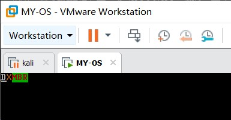

# Day 3

## 模拟加载 kernel

上一节中，我们通过磁盘，加载了额外的一个扇区到内存，但操作系统的内核远不止一个扇区那么大，毕竟`512 Byte`的大小还是很有限，因此我们还需要进一步扩增加载数量。

这一节，不会有太多的新内容，只是对上一节的一个延续，也是为后续做准备。

首先创建一个`day3.asm`

```assembly
KERNEL_BASE_ADDR EQU 0X1500
              SECTION LOADER VSTART=KERNEL_BASE_ADDR
              MOV AX, 0XB800
              MOV ES, AX

              MOV BYTE [ES: 0X00], 'D'
              MOV BYTE [ES: 0X01], 0X07
              MOV BYTE [ES: 0X02], 'X'
              MOV BYTE [ES: 0X03], 0X06
              JMP $
```

上面这个文件和`loader.asm`是不是有些相似，只是改变了起始地址，我们把`kernel`的起始地址设置位`0x1500`，比`loader`往后了一些。

同时我们修改原来的`loader.asm`文件，这里的读磁盘的子过程没有变化，变化的是读取的磁盘扇区偏移量和加载到内存的地址。

```assembly
LOADER_BASE_ADDR EQU 0X900          	;加载第2个段的地址
KERNEL_BASE_ADDR EQU 0X1500
KERNEL_START_SECTOR EQU 0X9         	;kernel从第9个扇区开始读
              SECTION LOADER VSTART=LOADER_BASE_ADDR

              MOV AX, 0XB800        	;显存位置
              MOV ES, AX

              MOV BYTE[ES: 0X00], 'O'
              MOV BYTE[ES: 0X01], 0X07
              MOV BYTE[ES: 0X02], 'K'
              MOV BYTE[ES: 0X03], 0X06

              MOV EAX, KERNEL_START_SECTOR	;LBA 读入的扇区个数
              MOV BX, KERNEL_BASE_ADDR	;KERNEL的起始地址
              MOV CX, 1

              CALL READ_DISK
              JMP KERNEL_BASE_ADDR

              ;读扇区
              READ_DISK:
              ;同day2.asm文件
```

这里需要修改`Makefile`文件，主要变化体现在`dd.exe`需要将`kernel`写入第9个扇区。

```makefile
# 默认动作
TOOL_PATH = ../tools/
ASSEMBLE  = ../tools/nasm/

MAKE      = $(TOOL_PATH)make.exe -r
NASM      = $(ASSEMBLE)nasm.exe
DD        = $(TOOL_PATH)dd.exe
DEL       = del
COPY      = copy

default :
	$(MAKE) mbr
	$(MAKE) kernel
	$(MAKE) loader

# 镜像文件生成
kernel.bin : day3.asm Makefile
	$(NASM) day3.asm -o kernel.bin

loader.bin: loader.asm Makefile
	$(NASM) loader.asm -o loader.bin

mbr.bin : day2.asm Makefile
	$(NASM) day2.asm -o mbr.bin


# 其他指令
kernel:
	$(MAKE) kernel.bin

loader:
	$(MAKE) loader.bin

mbr:
	$(MAKE) mbr.bin

clean:
	-$(DEL) *.bin

add:
	$(DD) if=mbr.bin of=dingst.vhd bs=512 count=1
	$(DD) if=loader.bin of=dingst.vhd bs=512 count=1 seek=2
	$(DD) if=kernel.bin of=dingst.vhd bs=512 count=1 seek=9

backup:
	-$(DEL) dingst.vhd
	$(COPY) ..\Backup\dingst(empty).vhd  dingst.vhd

run:
	-$(DEL) ..\dingst.vhd
	$(COPY) dingst.vhd ..\dingst.vhd
```

最后只需要执行以下命令即可。

```bash
make add
make
make run
```

再次开启虚拟机，可以看到程序成功输出了`DX`，表明`kernel`加载是成功的。



 ## [Day 4](OS/day4/day4.md)