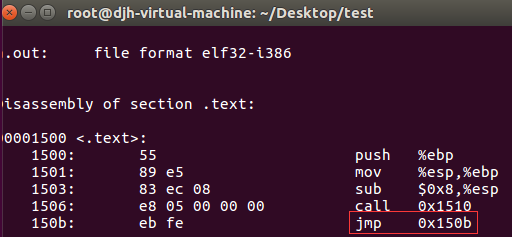
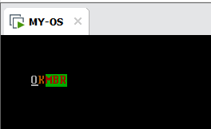

# Day 4

## 前言及工具安装

前`3`章的学习中，我们走完了第一小步，也就是加载所谓的"内核"，但内核的编写我们并不想全部使用汇编(`Assembly`)。因此这一章，我们将导入`C`语言，帮助我们编写更多的功能。

这里使用`C`语言，并不是像平时那样，用`C`语言各种库编程，而是使用`C`语言的框架，因为它的逻辑结构比汇编可读性要高很多！遗憾的是，我们不能用任何库函数，因为这些库函数也依赖于`OS`。

这里我们使用的工具是[`ubuntu-16.04.6-desktop-i386`](http://releases.ubuntu.com/16.04/)，在我的尝试中，`64`位的`linux`使用`-m32`编译出的`32 bit`文件和本身使用`32`的`linux`编译的结果还是有差异，最后的结果并不能很好兼容。因此最好能够使用这一版本的虚拟机，并且它也很常见，提醒一点，虚拟机开机如果黑屏，直接关机，修改其设置，不要使用加速`3D`。其余安装教程都比较简易，可以参考网络的一些教程。

## 正式开始

这里我们用`C`语言实现一个简单的内核，及向屏幕输出两个字符`OK`，然后进入死循环。我们想用这段`C`语言编译后的结果，替代之前用汇编写的`kernel.asm`文件。这看似没有太大的意义，但是如果这一步能够实现，之后我们可以用类似的方式，`C + Assembly`联合编程，帮助我们高效开发。

`day4.c`代码如下:

```c
void MYPRINT();
int DISPLAY(){
	MYPRINT();
		while(1){
	}
}
```

这段代码你再熟悉不过了吧，但函数`MYPRINT`的实现不在这个文件中，而是用汇编实现。同时我们看到，程序中，没有`main`函数，因为程序的调用入口点不在这个文件中，而是被定义在了汇编文件`_start`，当然这些也不是很重要，暂时不理解也没有关系。

接下来我们看看汇编`day4.asm`。

```assembly
              EXTERN DISPLAY        	;FROM C
              [BITS 16]
              [SECTION .TEXT]
              GLOBAL _start
              GLOBAL MYPRINT
              _start:
              CALL DISPLAY          	;ASM CALL
              MYPRINT:
              MOV AX, 0XB800
              MOV ES, AX
              MOV BYTE [ES: 0X00], 'O'
              MOV BYTE [ES: 0X01], 0X07
			 MOV BYTE [ES: 0X02], 'K'
              MOV BYTE [ES: 0X03], 0X06
              RET
```

这段汇编你也不会陌生，毕竟前面都写了很多次了，向屏幕输出`OK`两个字符，但是有几点，首先这里`_start`会被我们作为程序的入口点，汇编程序会调用`C`语言编写的`DISPLAY`函数。所以一开始声明了`EXTERN DISPLAY`，说明这是一个外部符号。

其余`mbr.asm`和`loader.asm`没有变化，和上一章一样，这里我们只是用尝试用`C`语言去写内核。

或许你会有疑问，这两个程序能够拼接吗？当然，这有些困难，原则上当然可以使用`ld.exe`把二者链接在一起，接下来我们将这两个文件拷贝到我们的虚拟机中。

* 将`day4.asm`汇编为一个`32`位的`elf`文件。

```bash
nasm -f elf32 -o dst.elf.o day4.asm
```

* 将`day4.c`用`gcc`编译为一个`obj`目标文件。

```bash
gcc -o kernel.elf.o -c day4.c
```

* 进一步，我们使用`ld`链接两个二进制文件。注意这个地方我们指定了程序的起始地址为`0x1500`，这个和我们在`loader.asm`中的地址是一致的，否则最后会跳转失败。如果程序找不到入口点，你可以用`-e _start`显示说明。

```bash
ld -s -Ttext 0x1500 dst.elf.o kernel.elf.o
```

接下来，我们使用`objdump -D a.out`，查看我们生成的二进制文件。



可以看到，这段反汇编的结果和`C`语言编写的逻辑是一致的。最后程序`jmp 0x150b`，也就是汇编中`jmp $`。

但这个文件实在是有些大，毕竟是一个标准的`elf 32bit`文件，你可以用`readelf -a a.out`查看其属性。

但回头看看我们上一章的`kernel.bin`，也就几十个字节，因此，我们不需要那些标识符，只需要一个纯粹的代码二进制文件。使用以下命令

```bash
objcopy -O binary a.out KRAW.BIN
```

最后可以看到，我们产生的`KRAE.BIN`仅仅有`100 Byte`左右，与`kernel.bin`非常类似。

## Makefile 

最后，我们将得到的`KRAW.BIN`拷贝到外面，修改`Makefile`。

```makefile
# 默认动作
TOOL_PATH = ../tools/
ASSEMBLE  = ../tools/nasm/

MAKE      = $(TOOL_PATH)make.exe -r
NASM      = $(ASSEMBLE)nasm.exe
DD        = $(TOOL_PATH)dd.exe
DEL       = del
COPY      = copy

default :
	$(MAKE) mbr
	$(MAKE) loader

# 镜像文件生成
loader.bin: loader.asm Makefile
	$(NASM) loader.asm -o loader.bin

mbr.bin : day2.asm Makefile
	$(NASM) day2.asm -o mbr.bin

# 其他指令
loader:
	$(MAKE) loader.bin

mbr:
	$(MAKE) mbr.bin

clean:
	-$(DEL) *.bin
	
add:
	$(DD) if=mbr.bin of=dingst.vhd bs=512 count=1
	$(DD) if=loader.bin of=dingst.vhd bs=512 count=1 seek=2
	$(DD) if=KRAW.bin of=dingst.vhd bs=512 count=1 seek=9 # 有变化!

backup:
	-$(DEL) dingst.vhd
	$(COPY) ..\Backup\dingst(empty).vhd  dingst.vhd

run:
	-$(DEL) ..\dingst.vhd
	$(COPY) dingst.vhd ..\dingst.vhd
```

依次执行以下命令。

```bash
make backup
make
make add
make run
```

最后再次启动虚拟机！屏幕输出了`OK`。



通过上述的步骤，我们成功地将`C`语言和汇编联合编程，并能够被系统识别加载，后续我们将继续用这种方式，完善我们的内核!

## [Day 5](OS/day5/day5.md)