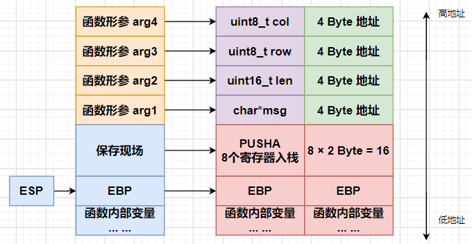
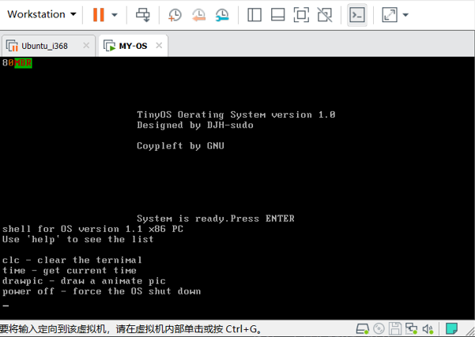

# Day 5

## 前言

在这一章，我们会进一步开发独立内核，首先我们再次回顾我们的思路`Boot->mbr->kernel`。我们要编写的正是`kernel`。

`C + Assembly`联合编程，我们主要解决两个部分，一个是`C`语言，一个是汇编。由于不能够使用一般的库函数，我们会用汇编对`BIOS`的功能进行封装，供C语言调用。

首先是要说明几点，由于我们最后的内核不算太小，所以我们将内核加载至内存的`0x8000`的位置，具体内存布局可以参考[`day2`](OS/day2/day2.md)的部分。其次，内核大小超过了一个扇区，因此我们需要修改加载扇区的个数。上面两个部分的修改，对应着`loader.asm`。

```assembly
KERNEL_BASE_ADDR EQU 0x8000
;.......
MOV CX,8
```

修改内核加载的基地址，同时修改加载的扇区个数，这里由原来的`1`改为了`8`

## 汇编部分

汇编部分需要做好`I/O`接口，供上层调用。这里我们一共定义了三个基本的`I/O`操作。

* `getch()`得到键盘键入的一个字符。
* `putchar()`向屏幕输出一个字符。
* `printInPos`向屏幕当前位置输出一个字符串。

```assembly
              BITS 16
              [GLOBAL printInPos]   	;Print content at the cursor
              [GLOBAL putchar]      	;Output one character
              [GLOBAL getch]        	;Get keyboard input

              ;Get keyboard input
              getch:
              MOV AH, 0             	;Function number
              INT 16H
              MOV AH, 0             	;Read characters, AL = characters
              RETF

              ;Print characters at the cursor
              putchar:
              PUSHA                 	;Protect the scene
              MOV BP, SP            	;Save the top of the stack
              ADD BP, 16 + 4        	;BP = 第一个参数的地址
              MOV AL, [BP]          	;AL = Print characters
              MOV BH, 0             	;BH = page number
              MOV AH, 0EH           	;function number
              INT 10H
              POPA
              RETF

              ;Display the string at the specified position
              printInPos:
              PUSHA
              MOV SI, SP            	;SI 保存 SP 的开始位置
              ADD SI, 16 + 4        	;这其实是第一个参数的地址,SI也就是msg的地址
              MOV AX, CS
              MOV DS, AX
              MOV BP, [SI]          	;BP = 栈底指针
              MOV AX, DS            	;
              MOV ES, AX            	;ES = DS
              MOV CX, [SI + 4]      	;CX = 字符串长度，SI + 4也就是第二个参数的地址
              MOV AX, 1301H         	
              ;functon number AH = 13 AL = 01H;
              ;Indicates that the cursor displays the end of the string
              MOV BX, 0007H         	;BH = page number BL = 07 black and white
              MOV DH, [SI + 8]      	;Line number= 0 同理，这里是第三个参数
              MOV DL, [SI + 12]     	;Column number = 0 这里是第四个参数
              INT 10H               	;BIOS 10H interrupt call
              POPA
              RETF
```

这一部分应该说是我们的"地基"，也是我们上层代码最直接的依赖。

上面的三段代码基本都是调用`BIOS`的`10H`输出功能和`16H`输入功能。在这里，我们要详细地解释一下这段代码，但如果你对汇编和`C`语言地关系足够了解，可以跳过至下一段。

首先代码为什么是这样的？这与我们设计的函数有关系，三个函数的模型如下：

```c
// Print content at the cursor
extern void printInPos(char*msg,uint16_t len,uint8_t row,uint8_t col); 
extern void putchar(char c);		 // Output one character
extern char getch();				// Get keyboard input
```

我们以第一个函数`printInPos(char*msg,uint16_t len,uint8_t row,uint8_t col); `为例。看看函数的调用栈帧。



请大家结合对应汇编代码看，我们基本能够明白这段汇编的含义，比如为什么`SI`要向上偏移`20 Byte`，因为这样才能访问到第一个参数的地址，而第一个参数正式我们字符串的首地`址，后面的参数访问是类似的道理。

而至于为什么要用`ES`，以及`DX`，这些寄存器，这与我们使用`BIOS`的[功能](https://zh.wikipedia.org/wiki/INT_10H)有关系，这些寄存器正是`10H`中断的`13H`

功能调用所规定的！当然，这里还有很多细节部分，比如调用约定。例如函数的参数是从右往左入栈的等等，这些细节可以在《程序员的自我修养》中得到进一步的解释说明！

## 自己编写C库函数

上一部分，基本揭示了汇编和`C`语言之间的关系，我们不妨编写一个供上层调用的`C`语言的库`stringio.h`。

```c
#include <stdint.h> //这个库并不依赖于操作系统

extern void printInPos(char*msg,uint16_t len,uint8_t row,uint8_t col); 	
// Print content at the cursor
extern void putchar(char c);		 // Output one character
extern char getch();				// Get keyboard input

// Calculate string length
uint16_t strlen(char *str){
	uint16_t count = 0;
	while(str[count++] != 0);
	return count - 1;
}
//... ... TODO
/*
// 这里可以用C语言编写大量的函数,可以使用上面三个extern外部导入的函数
// 具体的函数你可以参考源文件
*/
```

在工具链，也就是`stringio.h`上，我们进一步实现`libc.c`，具体代码请移步源文件，没有太多难度。

## 最后一部分，编写 kernel入口点

这里涉及到的两个函数`startUp`和`shell`均在`libc.c`有具体实现，这里作为外部符号引入。

```assembly
              BITS 16
              [EXTERN startUp]
              [EXTERN shell]

              GLOBAL _start
			  ;entry
              _start:
              CALL DWORD startUp
			  ;wait the keyboard
              KeyBoard:
              MOV AH, 0
              INT 16H
              CMP AL, 0DH
              JNE KeyBoard
              CALL DWORD shell
              JMP KeyBoard
```

整个汇编也很简单，首先调用一个显示信息的函数，然后等待键盘键入。

这里有几点我们要说明，`_start`是默认的入口点，但你可以不必这么命名，在最后链接时，用这样的形式`-e _start`，便可以指定程序的入口点。

## 在Ubuntu i386上编译链接

这里，我们再次用到`day4`中的工具，将这4个文件，分别是`stringio.h`，`lib.asm`，`libc.c`，`osKernel.asm`。

在虚拟机中，打开`vim`，写入编译和链接的规则`shell`文件`com.sh`。

```shell
# !/bin/bash
rm -rf temp;
mkdir temp;
chmod 777 temp;

nasm -f elf32 osKernel.asm -o ./temp/osKernel.o;
nasm -f elf32 liba.asm -o ./temp/liba.o;

gcc -c -m16 -march=i386 -masm=intel -nostdlib -ffreestanding -mpreferred-stack-boundary=2 -lgcc -shared libc.c -o ./temp/libc.o;

chmod 777 ./temp/osKernel.o;
chmod 777 ./temp/liba.o;
chmod 777 ./temp/libc.o;

ld -m elf_i386 -N -Ttext  0x8000 --oformat binary  ./temp/osKernel.o  ./temp/liba.o  ./temp/libc.o  -o  temp/osKernel.bin;

echo "have Dome!"
```

这段代码就类似于我们编写的`Makefile`一样，很方便，让我们不必每一次都重复敲命令。这里的代码我们主要解释`gcc`过程。这里几个参数的含义：

* `-m16` 编译为`16`位。
* `-march` 编译为`i386`
* `-nostdlib` 无需链接标准库
* `-mpreferred-stack-boundary` 对齐字节是2字节
* `-lgcc -shared` 编译并链接我们的自己的库`libc.c`

## 初步结果



到这里，我们基本搭建好了开发框架。

## [Day 6](OS/day6/day6.md)