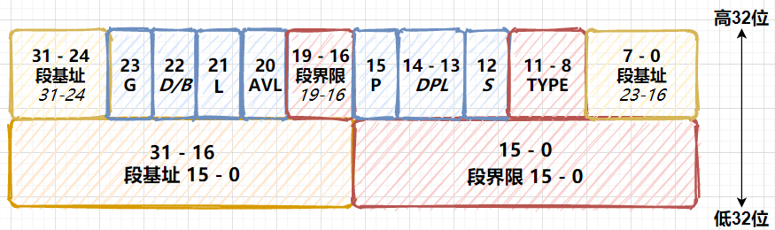
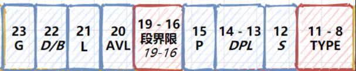
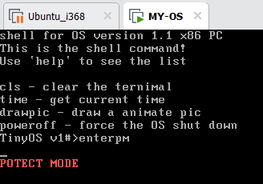

# Day 7

## 前言

从这里开始，又进入了比较难的一部分，也就是实模式向保护模式的转化。我们之前的程序都是基于实模式下编写的，这也是`x86`汇编最经典的部分。但是实模式的缺点有很多，例如`segement + offset`的寻址大小是有限的，只有`1M`字节。同时，程序的内存之间不是隔离的，有很大的操作空间，显然这是不安全的。

## 保护模式

在实模式中，我们可以对任意寄存器操作，同时也可以访问任意的内存空间，这虽然方便，但从安全角度而言，很危险，各个程序之间的内存不是隔离开来的。

所以从`.386`及以后，开始有了保护模式。保护模式访问内存的方式和实模式有一定的区别。寄存器的长度扩展到了`32 bit`。首先我们要认识几个新的改变:

在实模式下，逻辑地址就是实际的物理地址。即`segement + offset`的方式寻址。

但是保护模式下，每个应用程序的地址需要独立，它们从逻辑上有`4G(2^32)`的独立空间。要实现这一目的，首先硬件要支持(`MMU`)，即内存管理单元，负责将虚拟页面映射至物理页面。

### 平坦模型

* 首先，我们的要设置段的界限，以及每个段的访问权限，防止越界访问。

* 其次，`CS,DS`，这些段寄存器，不再是段基址，而是段选择子，这也就意味者放弃了直接访问物理内存的机会。因为只有段选择字和段描述符结合起来才能访问真实的物理地址。一个描述符是`8 Byte`，它们共同构成了全局描述符表。下面是段描述符的结构。

* |   `31 ~ 24`   | `23` | `22`  | `21` | `20`  | `19 ~ 16` | `15` | `14 ~ 13` | `12` | `11~8` |    `7 ~ 0`    |
    | :-----------: | :--: | ----- | :--: | :---: | :-------: | :--: | :-------: | :--: | :----: | :-----------: |
    | 段基址`31-24` | `G`  | `D/B` | `L`  | `AVL` |  段界限   | `P`  |   `DPL`   | `S`  | `TYPE` | 段基址`23-16` |

* |   `31 ~ 16`   |   `15 ~ 0`    |
  | :-----------: | :-----------: |
  | 段基址 `15-0` | 段界限 `15-0` |

* 1. `DPL`表示`CPU`工作在特权级还是用户级。
    2. `S`，`0`:是系统段,`1`:表示代码段/数据段。
    3. `G`，表示段界限的单位，`0`:字节为单位,`1`:`4KB`为单位。
    4. `L`，表示64的代码段标志。
    5. `TYPE`，表示描述符的字类型，`4`中组合方式，代码段/数据段，可读/可写/可执行。
    6. `P`，异常中断的检测。

* 为了支持上述复杂的功能，需要一个数据结构去描述，即`GDT`(全局描述符表)，这个数据结构在内存中。

### 流程

1. `CR0`寄存器将原有的`Segment + offset`寻址模式变为段选择子。
2. 初始化`GDT`
3. 打开`A20`地址线。
4. 打开`CR0`寄存器。
5. 进入保护模式。

## 汇编部分

### 	全局描述符

让我们再次回归一下段描述符，这是一个`64 bit`的结构。而`GDT`的每一项就是这样一个结构，所以顾名思义叫`Global Descriptor Table`。



而之前提到的段选择子的概念如下：

原有的段寄存器，如`CS`，`DS`，`SS`等，其不在是段基址，因为段基址在段描述符(上图)中已经规定好了，而这一个个`16`位的寄存器其结构变成了下面的形式。


其中高`13`位是索引值，也就是在`GDT`中的下标。`TI`表示是局部还是全局，即这个选择子是在`GDT`中，还是`LDT`(局部描述符表)中。低两位，是请求特权级，也就是`R0 ~ R3`。

接下来正式进入汇编部分，首先是一个宏。

```assembly
              %MACRO DESCRIPTOR 3
              DW %2 & 0FFFFH        	;段界限1 (2字节)
              DW %1 & 0FFFFH        	;段基址1 (2字节)
              DB (%1 >> 16) & 0FFH  	;段基址2 (1字节)
              DW ((%2 >> 8) & 0F00H) | (%3 & 0F0FFH)	;属性1 + 段界限2 + 属性2 (2字节)
              DB (%1 >> 24) & 0FFH  	;段基址3
              %ENDMACRO
```

这里宏有三个入口参数，即 `%1 %2 %3`。分别表示段基址，段界限(段内最大偏移量)以及段属性。我们知道一个描述符的长度是`64 bit`，也就是`8`字节。每一个位置的含义在上面这个图都有说明，而上面这段汇编的含义就是根据传入的这三个参数，填写对应的位置的值。后续我们一起看看实例。

这里我们定义了一些属性

```assembly
       DA_32  EQU 4000H             	;32位
        DA_C  EQU 98H               	;只执行代码段的属性
      DA_DRW  EQU 92H               	;可读写的数据段
     DA_DRWA  EQU 93H               	;存在的已访问的可读写的
              [SECTION .GDT]
              ;GDT
              ;				段基址，	段界限				属性
PM_GDT:         DESCRIPTOR 	0,		    0,				    0
PM_DESC_CODE32: DESCRIPTOR 	0,			SEGCODE32LEN -1,	DA_C + DA_32
PM_DESC_DATA: 	DESCRIPTOR 	0,			DATALEN-1,			DA_DRW
PM_DESC_STACK: 	DESCRIPTOR 	0,			TOPOFSTACK, 		DA_DRWA + DA_32
PM_DESC_TEST: 	DESCRIPTOR 	0200000H, 	 0FFFFH, 			DA_DRW
PM_DESC_VIDEO: 	DESCRIPTOR 	0B8000H, 	 0FFFFH, 			DA_DRW
              ;end of definiton gdt
      GDTLEN  EQU $ - PM_GDT
```

这里我们在写段描述符，这里我们传入的三个参数依次就是段基址、段界限以及段属性。利用`DESCRIPTOR`这个宏，能够帮助我们填写描述符的各个字段。

以我们的自己的段`PM_DESC_TEST`为例，这里段基址是`0200000H`，这个地址已经超出了`1M`的限制。值得一说的是，段界限一共是`20 bit`，最多就是`1M`，但是我们还没有说单位，如果属性字段`G = 1`，单位就是页`4KB`，否则就是字节。这里我们只是测试，所以填入了`0xFFFFH`。最后一个字段是属性。我们对应着汇编语句看。

* ```assembly
  DW %2 & 0FFFFH        	;段界限1 (2字节)
  ```

  ​	这句话的意思是，描述符的前两个字节的内容是 `%2 & 0FFFFH`，即第`2`个参数与`0xFFFF`按位与。

* ```assembly
  DW %1 & 0FFFFH        	;段基址1 (2字节)
  ```

   	段描述符的接下来两个字节，填入段基址的低`16`位，所以是`%1 & 0FFFFH`。这与上图的一致的。

* ```assembly
  DB (%1 >> 16) & 0FFH  	;段基址2 (1字节)
  ```

  ​	接下来的一个字节，是段基址`16 ~ 23`位，因此，我们的参数一，也就是段基址首先要右移`16`位，然后在按位与`0xFFH`，这样才能取到对应的位置。

* ```assembly
  DW ((%2 >> 8) & 0F00H) | (%3 & 0F0FFH)	;属性1 + 段界限2 + 属性2 (2字节)
  ```

  ​	接下来的两个字节，也就是下面这张图。

  

  那么首先是段界限左移`8`位，这样能够拿到段界限的高`4`位，然后与上`0F00H`，将其余位屏蔽，只保留段界限的位置。之后的`(%3 & 0F0FFH)`，起始就是属性位，这里可以看到，这`16 bit`刚好屏蔽了段界限，最后将二者拼接起来，用`|`(或运算)。

  `DA_DRW  EQU 92H`这样一个属性为什么就是可读可写呢。展开，即`0000 0000 1001 0010 B`，可以看到，这里`type = 2`，正是[可读可写的编码](https://blog.csdn.net/qq_35733751/article/details/91347768)。

* ```assembly
  DB (%1 >> 24) & 0FFH  	;段基址3
  ```

  ​	最后一个字节，是段基址的最高`8`位，因此需要将段基址右移`24 bit`。

其余的段的分析是类似的，我们也能看到宏定义的好处，那就是具备扩展性。

### 	选择子

```assembly
              ;GDT 选择子
SELECTOERCODE32 EQU PM_DESC_CODE32 - PM_GDT
SELECTOERDATA EQU PM_DESC_DATA - PM_GDT
SELECTOERSTACK EQU PM_DESC_STACK - PM_GDT
SELECTOERTEST EQU PM_DESC_TEST - PM_GDT
SELECTOERVIDEO EQU PM_DESC_VIDEO - PM_GDT
              ;END of [SECTION .gdt]
```

选择子，如果不看请求权限，其实就是索引，表明在`GDT`中的位置。

### 	数据段

​	接下来的部分就是自己定义的段，这里我们以数据段为例。

```assembly
              [SECTION .DATA1]
              ALIGN 32
              [BITS 32]
              PM_DATA:
              PMMESSAGE : DB "POTECT MODE", 0	;
		OFFSETPMESSAGE EQU PMMESSAGE - $$
     	DATALEN  EQU $- PM_DATA
              ;END of [SECTION .data]
```

在数据段中，我们定义了一个字符串，最后为了方便打印字符串，我们给出了字符串的相对偏移地址`offset`。

### 	初始化代码段

​	初始化代码段的汇编如下:

```assembly
			 XOR EAX, EAX
              MOV AX, CS
              SHL EAX, 4
              ADD EAX, PM_SEG_CODE32
              MOV WORD[PM_DESC_CODE32+2], AX
              SHR EAX, 16
              MOV BYTE [PM_DESC_CODE32+4], AL
              MOV BYTE [PM_DESC_CODE32+7], AH
```

我们逐句简单看看吧，首先是`XOR`，清零`EAX`寄存器操作，为什么要用`EAX`，这刚好是一个`32`位的寄存器，同时我们的基地址也是`32 bit`。

接下来把程序的实际运行的地址`CS`放入`AX`寄存器中，随后左移四位，因为我们知道实际这段程序还是在`16 bit`模式下运行的，我们还没有真正跳入保护模式，所以寻址方式依旧是`16 * segement + offset`。左移`4`位也就很正常了。而后面的`PM_SEG_CODE32`正是代码段的偏移地址，因此也要加给`EAX`寄存器。

之后，`EAX`中保存了我们代码段的地址，此时我们需要将这段地址写入描述符中，首先写入低`16`位，然后再分别写入其它两个字节。为什么要这么做呢，可以再看看这个图。


` MOV WORD[PM_DESC_CODE32+2], AX`，这里`+ 2`是跳过了前面两字节的段界限，而后面的`+ 4/ + 7`，道理是一样的，因为这里段基址不是连续的。

而初始化其它的段，和上面的代码没有实质性区别，需要修改的不过只是对应段的标号。

### 	加载 GDTR 

```assembly
          XOR EAX, EAX
          MOV AX, DS
          SHL EAX, 4
          ADD EAX, PM_GDT
          MOV DWORD [GDTPTR +2], EAX
          LGDT [GDTPTR]
```
这一段代码，我们利用指令`LGDT`，将`GDT`的初始位置，加载至特定的寄存器中。这里前面的初始化和代码段初始化是类似的，这里一次性把`GDT`地址写入内存，为什么要`+ 2`，这是因为寄存器`gdtr`一共`48 bit`，其中低`16`位用于存放全局描述符的边界，高`32`位用于存放`gdt`地址。所以这里`+ 2`也就是跳过低位的两个字节。

之后是对`A20`地址线和`CR0`寄存器操作，最后跳入保护模式。

```assembly
			 CLI
              IN AL, 92H
              OR AL, 00000010B
              OUT 92H, AL

              ;切换到保护模式
              MOV EAX, CR0
              OR EAX, 1
              MOV CR0, EAX
              JMP DWORD SELECTOERCODE32: 0
```

## 修改相应的地址

最后，在本地用`nasm`编译即可，将这个产生的二进制文件，写入磁盘的第20个扇区。

同时，我们在`liba.asm`中添加一个函数`callpm`，也就是跳转为保护模式。

```assembly
			  CALLPM:
			  ;进入保护模式
			  MOV EAX,20				;LBA 读入的扇区起始偏移
			  MOV BX,0X9000				;保护模式下KERNEL的起始地址
			  MOV CX,10					;读入扇区个数
			  
			  CALL READ_DISK
			  JMP 0x9000
```

这段代码，会将磁盘的第20个扇区开始，连续读入10个扇区，加载至内存的`0x9000`处。

同时，我们的`pm.asm`程序的入口地址，正好也是`0x9000`。这样，一旦扇区读写完成后，程序会自动跳转到这一地址，继续执行这里的程序，而`0x9000`处的程序，正是我们编写的实模式跳转至保护模式的程序。

```assembly
ORG 0X9000           	;起始地址
JMP PM_BEGIN          	;跳入到标号为PM_BEGIN的代码段开始推进
```

最后，重新编译内核`liba.asm`，修改并执行`Makefile`，开机。程序已成功进入保护模式。



## [Day 8 结语](OS/day8/day8.md)

